# GitHub Workflow

## Updating your Repository

Update your local copy of the repository by merging any changes from the upstream repository. To do so:

* Open GitHub Desktop and click the branch tab (the second tab on the top; it will say something like "main"): 
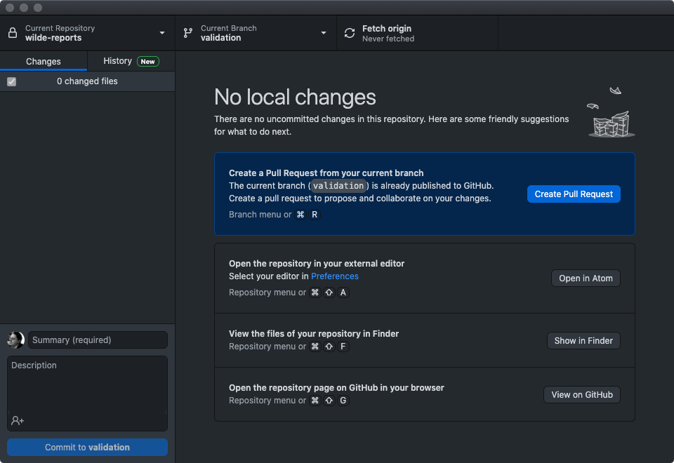

* In the branch menu, click Choose branch to merge into **main**:

* Click on "upstream/main":
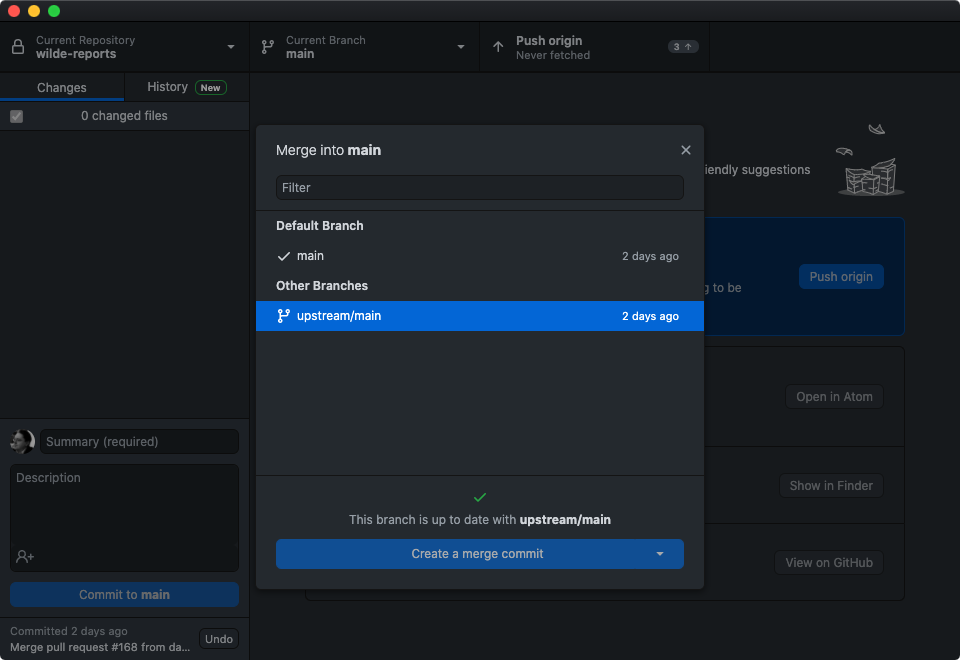
* Depending on whether your repository is up to date:
	* If there are no changes to merge (This branch is up to date ...), then you're done!
	* If there are changes to merge (This will merge x commits...), then click Merge upstream/main.

## Editing in oXygen

All work on the reports should be done in oXygen. It is an incredibly powerful and useful tool for editing XML & XHTML and there are a number of custom features and tools that will editing easier and more efficient.

When you open oXygen, make sure you see the `reports.xpr` project in the oXygen project pane (usually on the left-hand side):

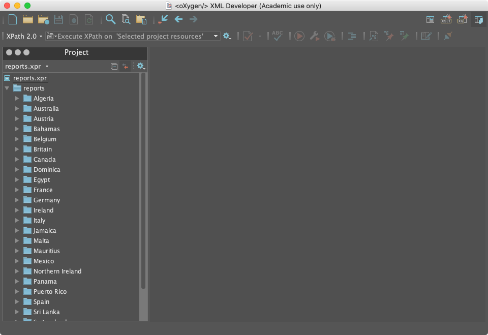

oXygen remembers the last project you opened, so it will usually use the `wilde-reports` project file automatically. If, for whatever reason, you are not in the `wilde-reports` project, make sure to open the project file by going to `Project/Open Project` in the toolbar. You can use the Project pane to navigate through the project files; all of the HTML files are in the `reports/` folder.

On your system, the folder may be called something else in oXygen (_wilde-reports_ is pretty likely). This is normal and expected. Besides, "reports" is a terrible name. It has been around for so long we cannot really change it anymore.

As you edit the HTML files in oXygen, it is imperative that you frequently and consistently validate your file. Invalidities in an oXygen are signalled much like spell-check: the invalid element is underlined in red and its location in the document is marked in the scrollbar.

oXygen validates for you automatically as you type, but it might lag (especially for large or complex documents), so it is best practice to trigger validation manually as well, especially before committing your changes.

To validate your document, you can either use the keyboard shortcut CMD+Shift+V (CMD = ⌘ on Mac) or click the red checkmark in the toolbar:

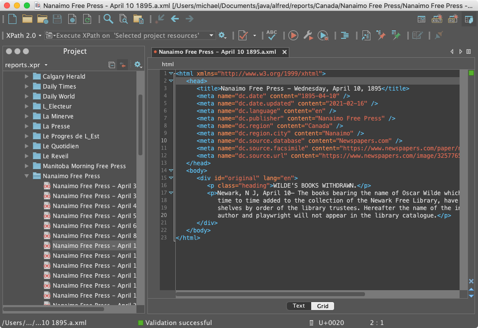

Once the document finishes validating, there will be a message at the bottom of the screen stating whether validation was successful. If there are errors in your document and validation fails, you will see the red underlines and a info box at the bottom of the screen that outlines the precise errors.  

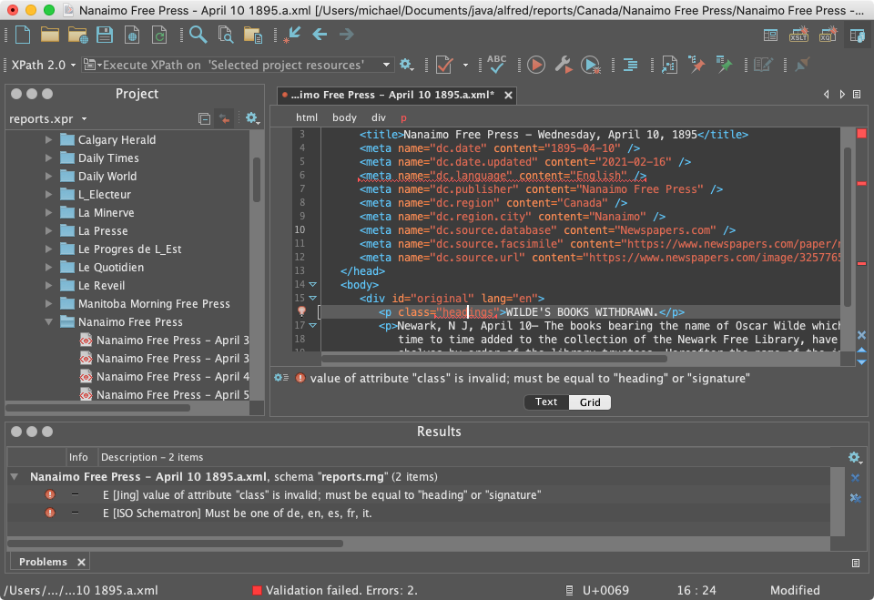

Try your best to determine what the error is: the validation message usually provides a good indication of what the error is (some are more helpful than others); the problem is quite often something simple like a typo, an errant space at the beginning or end of an element, or a missing quotation mark.

If you can't figure out the error, then it is OK to commit the file, but do let the team and the developers know right away so that the error can be resolved as soon as possible.

If you find an error message that is very unhelpful, and can think of better wording to make the error and appropriate resolution clear, please file a [GitHub Issue](https://github.com/sfu-dhil/wilde-schema/issues) and provide an example of the error and suggested improvement.

## Cleaning Up Old Reports

The guidelines for creating and editing reports have changed over time. The reports should have been updated to the most recent guidelines, but you may find some reports that have tags that we no longer use, or tags that are generated as part of the text processing.

We have automated as much of the clean up as possible. To clean this cruft from your document, you can either use the keyboard shortcut CMD+Shift+T (CMD = ⌘ on Mac) or click the red play icon in the toolbar (which oXygen unhelpfully calls _Apply Transformation Scenario_).

Before:
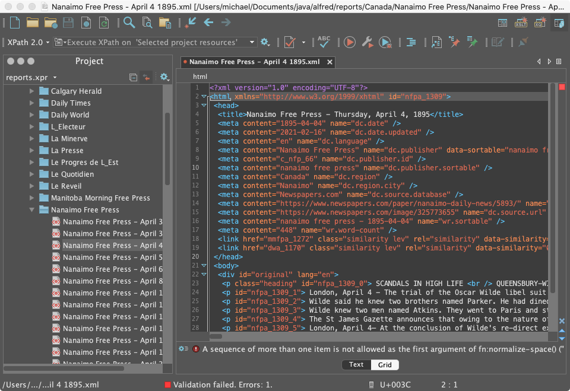

After:
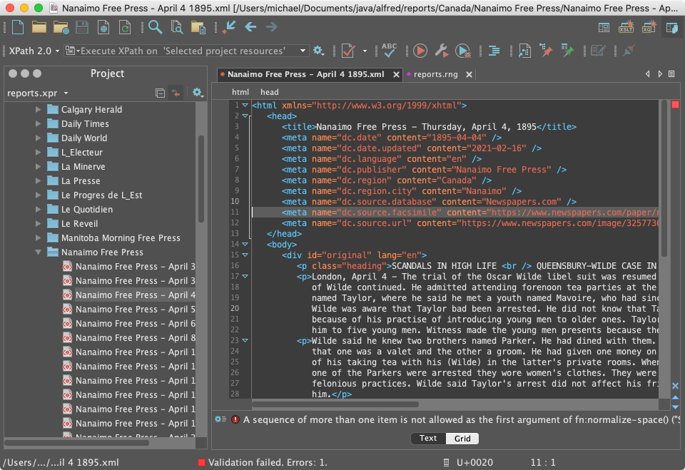

The cleanup script has removed the all the unnecessary, redundant, and generated content. These parts of the report have all been removed:

* The XML processing instruction `<?xml version="1.0" encoding="UTF-8"?>`
* The `id` attribute on the html tag
* All `link` and `a` tags
* Some meta tags, including `dc.publisher.sortable`, `wr.sortable`, `wr.word-count`
* Meta attributes have been reorded so that name is first for readability
* Paragraph `id` attributes
* The translation `div` (not shown in this example)

And the attributes on `meta` tags have been reorded. The name attribute is first to aid readability, and the meta tags have been sorted by the name attribute.

## Preview

Finding errors in raw XML can be difficult. For that reason we have added a preview in oXygen.

The default action in oXygen is to clean up the current report. For the preview to work you must switch to the preview action.

Click the wrench icon in the toolbar. Uncheck `Clean Report` and check `Preview Report`.

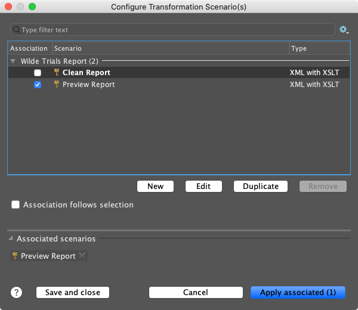

Now when you use the keyboard shortcut CMD+Shift+T (CMD = ⌘ on Mac) or click the red play icon in the toolbar, oXygen will generate a preview file and open it in the web browser of your choice. The display will mimic the display on the live site, including the metadata. You can proof the report and make any corrections in oXygen.

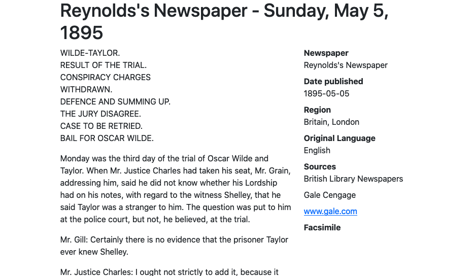

## Committing Changes

After you've made a set of changes (i.e. before you take a break or before the end of your work day) and confirmed that they were valid, you need to commit those changes to the repository. To do that, navigate to GitHub Desktop, which should show you a list of changes that you've made:
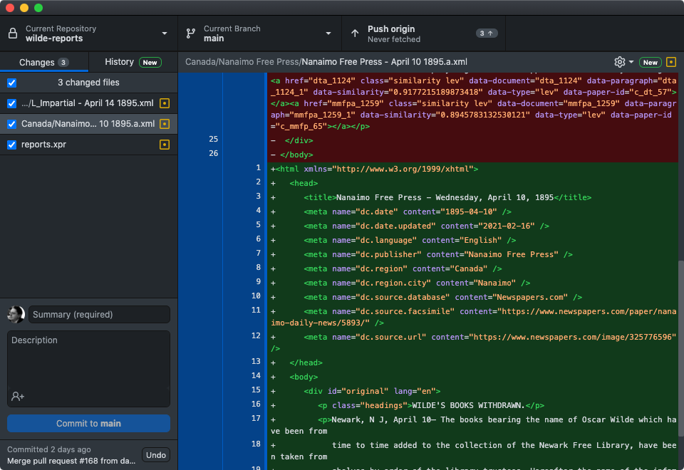

It is a good idea to review those changes to make sure everything looks right (i.e. all of the files that you actually changed are listed; there are no additional changes). (You may see that the `reports.xpr` oXygen project file has changed even though you didn't do anything to it—that's expected).

Assuming that everything looks correct, you can then commit those files by filling out the commit message boxes in the bottom left-hand corner.

These commit messages are helpful for record keeping and for tracking changes to the files; note that these commit messages are both permanent and public. In the `Summary` field, add a brief description of what you've done (i.e. "Added index items for vol7"). If there is additional information you'd like to add, put a longer explanation in the `Description` box.

## Pushing Changes to GitHub

Once you have committed your changes, you must push the changes to GitHub's servers. Do that by clicking the "Push Origin" button in the GitHub Desktop window.

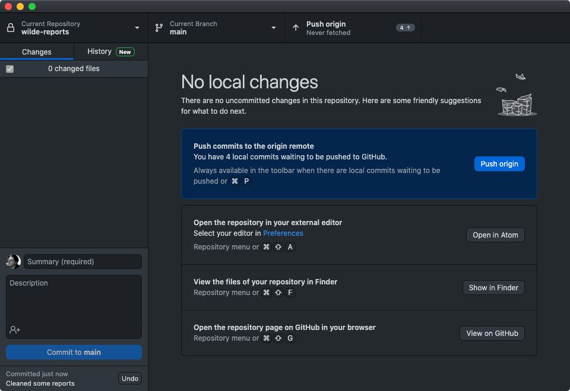

## Creating a Pull Request

When you have completed work on one paper and are ready for your changes to be incorporated into the central Wilde Trials repository you should create a pull request. This is done through the GitHub website.

Open the GitHub web page for your fork of the Wilde Reports repository. There should be a message similar to "This branch is 1 commit ahead of sfu_dhil:main." Next to the message is a `Contribute` drop down. Use the `Open pull request` button to start a pull request.

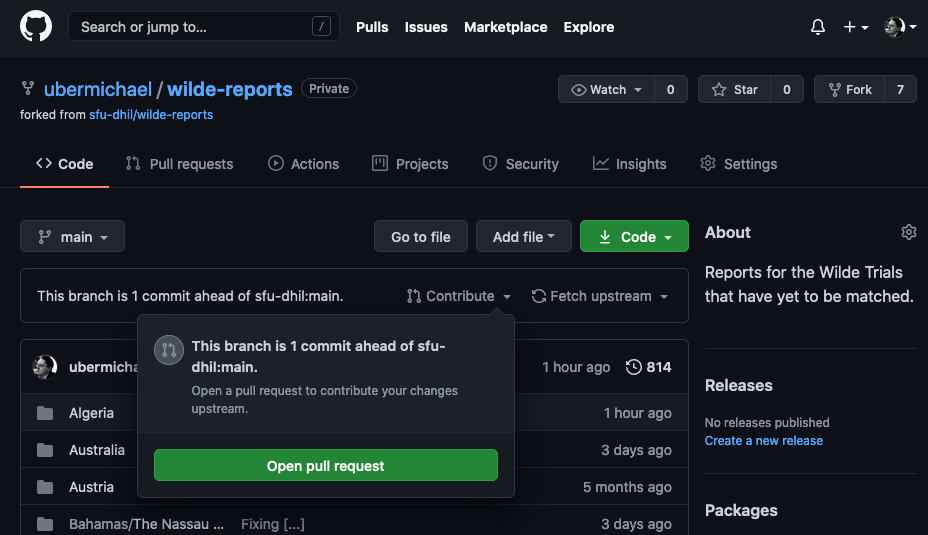

Now is another chance to review your work. Check carefully, and if you need to make changes, return to oXygenXML and edit the appropriate file. Commit and push any corrections.

Once you are satisfied with the changes, use the `Create pull request` button. Create the pull request by filling out the message `Title` and `comment` boxes. In some cases GitHub may pre-fill the title and comment fields. Check that they are accurate and edit add any additional information you believe is important.

These pull request messages are helpful for record keeping and for tracking chages to the reports. They are permanent and may be public in the future.

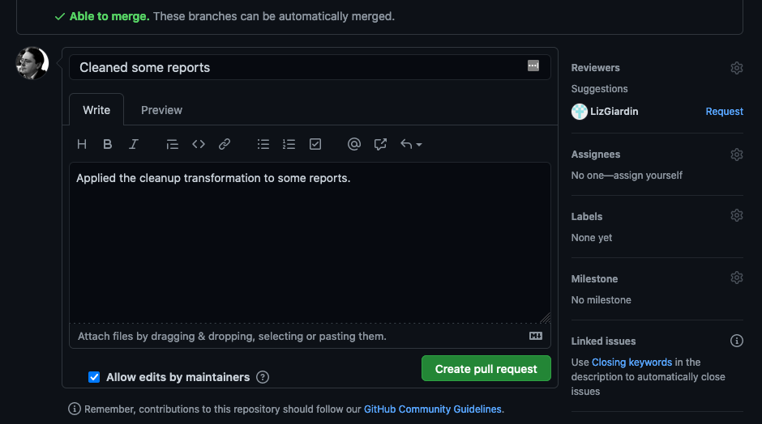
